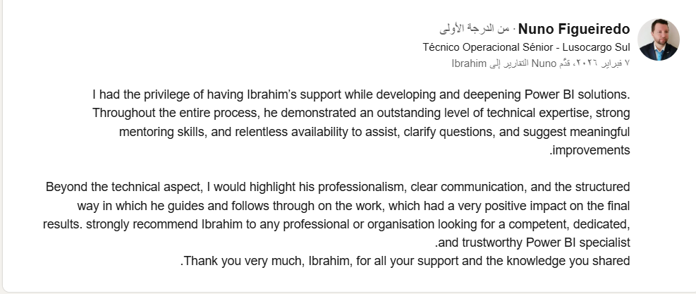

Financial Intelligence & Strategic Dashboard (2024-2026) 📊

📌 Project Overview

This project was developed for a Traffic Manager in Portugal to transform raw operational data into a high-level strategic decision-making tool. The solution focuses on monitoring key financial indicators, revenue trends, and cost-efficiency correlations, with all values localized in Euros (€).

🚀 Key Achievements

1-Professional Validation: The dashboard and analysis were so impactful they were featured as a primary case study in a Master's thesis presentation, receiving excellent feedback.

2-Advanced Data Modeling: Built a dynamic Power BI dashboard focusing on monthly and quarterly performance metrics.

3-Strategic Reporting: Authored a comprehensive 2024-2026 financial review and a risk assessment report identifying key anomalies.

🛠️ Tools & Deliverables

1-Power BI Dashboard: Interactive visualization for KPI tracking and financial health monitoring.

2-Strategic Presentation: Developed using Gamma to communicate complex data as actionable growth strategies.

3-Analytical Insights Report: A detailed document covering quarterly performance and anomaly detection.

💬 Client Feedback & Recognition

"I’ve already reviewed the files and they look fantastic... I gave a presentation of my work for my Master’s thesis and included the Power BI work you developed. It was very well received." — Nuno Figueiredo, Senior Operational Technician.

🏆 Recommendation

Below is the official recommendation received on LinkedIn regarding the success of this project:

